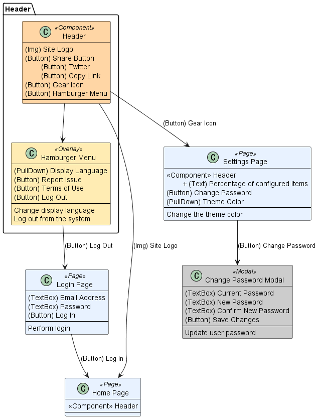

# UCOD

## ABOUT
- UCOD (/juːkɒd/, UI Class Operation Diagram) is a modeling notation based on class diagrams and screen transition diagrams.
- It is designed for documentation, system analysis, and AI-assisted test design and implementation.



---

## How to Describe UCOD
- Each UI class represents a single Page, Modal, Component, or similar UI unit, and is described using the following three-layer structure:
    - UI class name: the name of the screen, modal, or UI component
    - UI elements: the interactive or visual elements contained in the class (e.g. buttons, text fields)
    - User actions: the actions performed by the user on the screen, described below a horizontal divider (`---`)
- UI elements are listed with prefixes such as `(Button)`, `(TextBox)`, `(Link)`, etc.
- If UI classes differ slightly in their contained UI elements, additions or removals can be expressed using `+` or `-` at the beginning of the line.
- Transitions between UI classes are expressed using arrows (`-->` or `<->`), optionally annotated with the triggering UI element.
    - If the trigger is self-explanatory (e.g. pressing the “Settings” button opens the settings page), the label may be omitted.
- [Design guide](./docs/ucod-design-guide.en.md)

---

## Use Cases
- Specification modeling:
    - UCOD helps organize specifications for web-based products in a way that is friendly to both humans and generative AI.
    - It is also useful for identifying areas for improvement, such as pages that contain too many UI elements or UI classes that frequently add or remove elements.
- AI-assisted test case design:
    - By providing UCOD to a generative AI, you can design a basic test suite for happy-path scenarios that covers UI elements and page transitions.
    - By combining UCOD with test viewpoint diagrams, test suites that include non-happy-path scenarios can also be designed.
    - [Sample prompt](./prompts/generate-testcases.md)
- AI-assisted automated test implementation:
    - By providing UCOD to generative AI and having it interpret UCOD as a design model for POM (Page Object Model), all of Page Objects, Assertions, and Test Code can be automatically generated.
    - [Sample prompt](./prompts/generate-pom.md)

---

## Directory Structure
```
.
├─ README.md                 # this file
├─ docs/
│  ├─ ucod-design-guide.en.md
│  └─ ucod-design-guide.ja.md
├─ prompts/
│  ├─ generate-pom.md        # Sample prompt for AI-assisted implementation of automated tests using POM
│  └─ generate-testcases.md  # Sample prompt for AI-assisted test case design
└─ samples/
   ├─ ucod-sample.puml
   └─ test-viewpoint-sample.puml
```